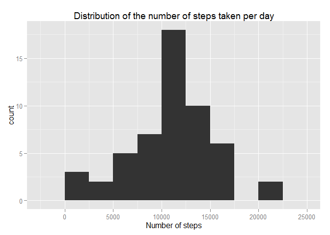
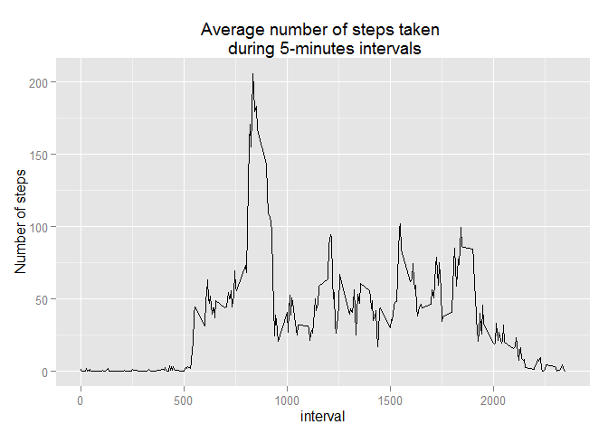
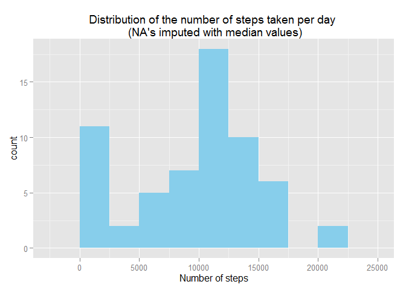
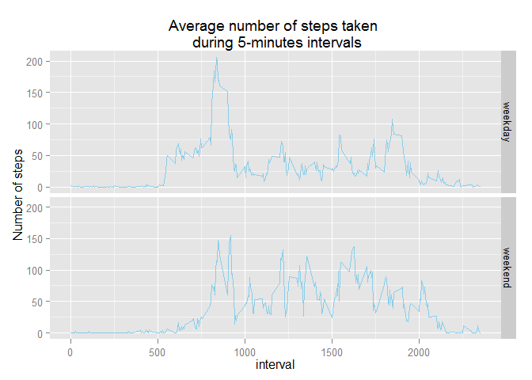

# Reproducible Research: Peer Assessment 1


## Loading the data 

Data is loaded from the unzipped `activity.zip` file. The dplyr package is loaded, as it will be used in data manipuation efforts to answer the upcoming questions 


```r
activitydata <- read.csv("./activity.csv")
library(dplyr)
```

```
## 
## Attaching package: 'dplyr'
## 
## The following object is masked from 'package:stats':
## 
##     filter
## 
## The following objects are masked from 'package:base':
## 
##     intersect, setdiff, setequal, union
```

```r
activitydata <- tbl_df(activitydata)
```


## 1. What is mean total number of steps taken per day?
#### 1.1 Histogram  
A histogram is created to show the number of steps taken each day. Note that is shows the distribution (histogram), and is not a bar plot of each day individually.


```r
#some data prep
by_date <- group_by(activitydata, date)
stepssum <- summarise(by_date, totalsteps=sum(steps))
```


```r
require(ggplot2)
```

```
## Loading required package: ggplot2
```

```r
ggplot(stepssum, aes(x=totalsteps)) + geom_histogram(binwidth=2500)+
  ggtitle("Distribution of the number of steps taken per day")+
  xlab("Number of steps")
```

 

####1.2 Mean & median

The mean and median of the number of the number of steps taken per day is shown below, ignoring `NA` values


```r
mean_steps <- mean(stepssum$totalsteps, na.rm = TRUE)
mean_steps
```

```
## [1] 10766.19
```

```r
median_steps <- median(stepssum$totalsteps, na.rm = TRUE)
median
```

```
## function (x, na.rm = FALSE) 
## UseMethod("median")
## <bytecode: 0x0000000007a97088>
## <environment: namespace:stats>
```


## 2. What is the average daily activity pattern?
####2.1 Timer series plot
The plot below shows the average number of steps taken at all the 5-minute intervals of the day.
There are a total of 288 5-minute intervals (24 hrs * 60 minutes, divided by 5)


```r
by_interval <- group_by(activitydata, interval)
intervalavg<- summarise(by_interval, avgsteps=mean(steps, na.rm=T), medsteps=median(steps, na.rm=T))
#alternatively could use filter(by_interval, !is.na(steps)) to only work with complete cases, but alas
```


```r
ggplot(intervalavg, aes(interval, avgsteps)) + 
    geom_line() +
    ggtitle ("Average number of steps taken \n during 5-minutes intervals") +
    ylab("Number of steps")
```

 

####2.2 Highest 5-minute interval average
Below, we see that the `835` interval has the highest average number of steps taken.
Note that this identifier corresponds to the 5-minute interval of 8:35AM - 8:40AM

```r
intervalavg$interval[which.max(intervalavg$avgsteps)]
```

```
## [1] 835
```

## 3. Imputing missing values
####3.1 Number of rows with `NAs`

Out of a total of 17,568 observations, we will check how many have missing values (`NAs`)

```r
sum(is.na(activitydata$steps))
```

```
## [1] 2304
```

```r
#alternatively, sum(!complete.cases(activitydata$steps))
```

####3.2 Imputing strategy
Missing values (`NAs`) in the dataset will be replaced by the median value of that specific 5-minute interval

####3.3 Create a new dataset
A new dataset will be created, following the above mentioned imputing strategy.


```r
activitydata_clean <- mutate(activitydata, steps= ifelse(is.na(steps), intervalavg$medsteps, steps))
```

####3.4(a) Histogram

A histogram --similar to the one in section 1.1 -- will be created. This time we will use the newly created dataset.


```r
by_date_clean <- group_by(activitydata_clean, date)
stepssum_clean <- summarise(by_date_clean, totalsteps=sum(steps))
```


```r
require(ggplot2)
ggplot(stepssum_clean, aes(x=totalsteps)) + geom_histogram(binwidth=2500, fill="sky blue")+
  ggtitle("Distribution of the number of steps taken per day \n (NA's imputed with median values)")+
  xlab("Number of steps")
```

 

####3.4(b) Mean & median

The mean and median are recalculated

```r
mean_steps_imputed <- mean(stepssum_clean$totalsteps)
mean_steps_imputed
```

```
## [1] 9503.869
```

```r
median_steps_imputed <- median(stepssum_clean$totalsteps)
median_steps_imputed
```

```
## [1] 10395
```

####3.4(c) Difference in data

We see below that replacing missing values with their 5-minute median value has caused both the mean and median to decrease. 


```r
mean_steps_imputed - mean_steps
```

```
## [1] -1262.32
```

```r
median_steps_imputed - median_steps
```

```
## [1] -370
```


##4. Are there differences in activity patterns between weekdays and weekends?

####4.1. Weekday & weekend
Below, we add a new variable to the imputed data set. The variable `day_indicator` is a factor with 2 levels. It takes on the value `weekend` for all the Saturdays and Sundays in the data, and takes the value `weekday` for the rest of the days of the week.


```r
Weekend_days  <-  weekdays(as.Date(activitydata_clean$date)) == "Sunday" | weekdays(as.Date(activitydata_clean$date)) == "Saturday"
activitydata_clean$day_indicator[Weekend_days] <- "weekend"
activitydata_clean$day_indicator[!Weekend_days] <- "weekday"
activitydata_clean$day_indicator <- as.factor(activitydata_clean$day_indicator)
```

####4.2 Panel plot

We now create a timeseries plot, similar to the one done in section 2.1. But here, we use the newly created variable to seperate activity done on weekends and weekdays.


```r
by_interval_weekday <- group_by(activitydata_clean, interval, day_indicator)
intervalavg_weekday<- summarise(by_interval_weekday, avgsteps=mean(steps, na.rm=T))
```


```r
ggplot(intervalavg_weekday, aes(interval, avgsteps)) + 
    geom_line(colour="sky blue") +
    facet_grid(day_indicator~.) +
    ggtitle ("Average number of steps taken \n during 5-minutes intervals") +
    ylab("Number of steps")
```

 
